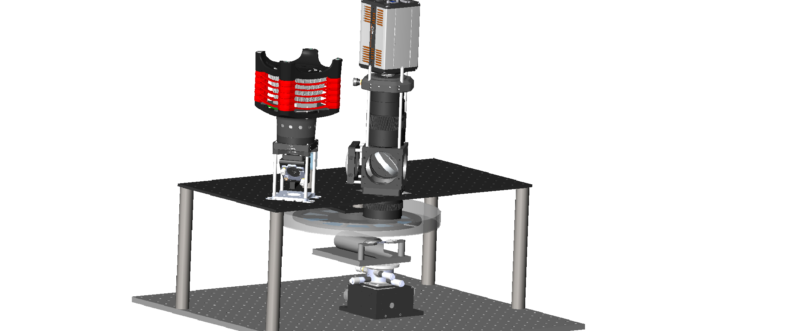

# SMART-microscopy
SMART is short for Spinning-disk Mesoscale ARbitrarily-shaped Surface imaging Technique, an open source framework adapted to different mesoscope and macrosopes.   
  

  

  

## Part list
### Spinning disk
* Disk, Customized from CNC, $50
* [Glass](https://item.taobao.com/item.htm?spm=a1z09.2.0.0.68c82e8dmFWsRe&id=536537929007&_u=8h1dbqsf77b), Thickness 0.16, 0.33, 0.55, 0.71, 0.88, 0.98, 1.33, 1.43, 1.5 mm, $100
* [IR detector](https://item.taobao.com/item.htm?spm=a230r.1.14.96.26a6262etMtMfx&id=565341450720&ns=1&abbucket=11#detail), $5
* [Rotation stage](https://item.taobao.com/item.htm?spm=a1z09.2.0.0.10132e8dwd0SDd&id=626679376761&_u=8h1dbqsd1cc), IM6824H  Lika Tech, $50
* [Motor drive](https://item.taobao.com/item.htm?spm=a1z09.2.0.0.10132e8dwd0SDd&id=628139875189&_u=8h1dbqs5019), 12-36V Lika Tech, $30
* [UV glue](https://detail.tmall.com/item.htm?spm=a230r.1.14.22.59be7edbpFXC4D&id=575402772223&ns=1&abbucket=11), 3218uv Valigoo, $1
* Tapes
### Selective illumination
* [Digital Micromirror Device](https://www.vialux.de/Website/PDF/ALP/Specification-V-Modules-Frame-Rates.pdf), V-7001 Vialux, ~$10000
* [LED](https://www.thorlabschina.cn/newgrouppage9.cfm?objectgroup_ID=8986), SOLIS-470C & DC20 Thorlabs, ~ $2,000
* [Relay lenses](https://www.thorlabs.com/thorProduct.cfm?partNumber=AC508-100-A), AC508-100-A Thorlabs, $100
### Synchronization
* [DAQ](https://www.ni.com/zh-cn/support/model.pxie-6363.html), USB-6363 NI, ~$3000
* Jump wire, $5
* PC, ~$2000
### Macroscope
* SLR lenses, Canon EF 50mm f/1.4 USM & MINILTA AF 100mm f/2.8, ~$200 for two second-hand lenses
* [Dichroic mirror](https://www.thorlabs.com/thorproduct.cfm?partnumber=DMLP505L), DMLP505L thorlabs, $400
* [Excitation filter](https://www.thorlabs.com/thorproduct.cfm?partnumber=FESH0500), $200
* [Emission filter](https://www.thorlabs.com/thorproduct.cfm?partnumber=MF525-39), $300
* [sCMOS detector](https://andor.oxinst.com/products/scmos-camera-series/zyla-5-5-scmos), Zyla 5.5 Andor, ~$20000

## Software Platform and code list
* Matlab R2020a  
`DMDCalibration/calculateTransform.m`calibrates the coordinates of DMD with sCMOS piexels.   
`surfaceDetection/generateDMDPattern.m` fits the arbitary surface and thereby generates target galss thickness.   
`DataAnalysis/NauralActivityAnalysis` generates the neural results.  
* Qt 5.14.2     
[`widefield/debug/widefild.exe`](https://figshare.com/s/6e0073230477a9e31000) is the executable program for SMART microscopy.
* Labview 2019 64 bit  
`acq/SMART.vi` is the main vi for SMART microscopy
* Python   
`boplot.py` plots the boxpolot figures with Seaborn.
* Solidworks 2020  
`SMART.stl` is the drawing of the spinning disk   

## Downloads
### System implementatoin
* [Andor SDK3.15](https://andor.oxinst.com/downloads/view/andor-sdk3-3.15.30084.0) 
* [Andor SDK3 Labview for sCMOS](https://andor.oxinst.com/assets/uploads/andor-support-resources/FAQ031.pdf)
* [Micromanager with Andor SDK3](https://micro-manager.org/Andor_SDK3) 
* [VIALUX-3P-ALP-4](https://www.ti.com/tool/VIALUX-3P-ALP-4) is the controller for DMD
### Data analysis
* [CNMF-E](https://github.com/zhoupc/CNMF_E)
* [circularGraph](https://ww2.mathworks.cn/matlabcentral/fileexchange/48576-circulargraph)
* [@msdanalyzer](https://ww2.mathworks.cn/matlabcentral/fileexchange/40692-mean-square-displacement-analysis-of-particles-trajectories)

## Step 1: Assembly of the spinning disk
1.	Our spinning disk is made of alumina. It is recommended to oxidize and paint the surface black. We attach a stick to the edge for synchronization
2.	The cover glass is cut by the manufacturer. We designed the glass to be a fan shape with an outer radius of 110 mm and an inner radius of 50 mm at an angle of 34 degrees. 
3.	Fix the glass plates to the disk with UV glue, and secured them with tape. The arrangement of the glasses is carefully designed to keep the center of mass on the axis.
4.	Attach the disk to the rotation stage, and connect the stage to the motor driver. 
5.	Fix the U-shaped IR detector close to the disk, so that the stick can trigger a digital edge.
6.	Put the whole system in a box for high-speed applications. 

## Step 2: Assembly of the illumination
1.	Our illumination light path is identical to the conventional structured illumination light path. But we use regional illumination so it has a lower requirement for optical design
2.	First relay the illumination LED to the DMD so that a uniform pattern is formed, as instructed by the manufacturer. 
3.	Relay the DMD through the doublet lens and objective the specimen.
4.	Drop some fluorescence solution on the slide and cover it with a cover glass.
5.	Generate some patterns (points) on the DMD, and record the image on the camera.
6.	Align the coordination on the camera to the coordinate of DMD (in Matlab control point select tool), with images from the camera and the DMD.

## Step 3: Signal synchronization
1.	We develop two modes for synchronization: a master mode and a slave mode. In the master mode, the position of the spinning disk works as the trigger source, while the DMD and camera follow the time sequence of the disk. However, for systems in which we cannot control the trigger of cameras, we use a slave mode in which the disk and DMD follow the timing of the camera.
2.	In the master mode, we first set the voltage of the motor drive to control the speed of the disk. At the start of each cycle, the stick on the disk triggers a signal on the IR detector and sends the message to the counter on DAQ. Then a digital trigger signal is sent to initiate the start of camera exposure and another trigger signal is sent to the DMD to start its display.
3.	The exposure time of the camera is set to be equal to the duration of the rotation.
4.	The display time of the DMD is set to equal to the time for each cover glass. 
5.	If there are more than more cover glasses in the field of view, the LED is turned off.
6.	In the slave mode, everything is the same except that a PID process is used to set the control voltage on the motor, so that the period of rotation is equal to the exposure time of the camera. 
## Step 4: Surface detection
1.	On an initial scan, the disk rotates at a low speed and the camera takes one image at each cover glass. 
2.	The images are rearranged according to the order of the glass thickness. 
3.	Apply algorithms to extract the features. For example, to detect the position of neurons, we first use standard derivation to the time sequence, then threshold the image to make it binary and apply morphological algorithms to extract the connected regions in the image. Finally, we sort the regions by parameters such as areas and eccentricity.
4.	We fit the shape of our surface by assuming the surface is continuous in 3D space. The shape of the surfaces can be set to polynomial or any smooth surface.
5.	Discrete the surface into 10 heights, and make 10 binary masks accordingly. 

## Step 5: Image acquisition
1.	Apply the map-table in Step 2.6 to the illumination pattern, and set the DMD.
2.	For Labview detection, follow this [manual](./Labveiw/readme_labview.md). For QT detection, download this [zip file](https://figshare.com/s/6e0073230477a9e31000). 
